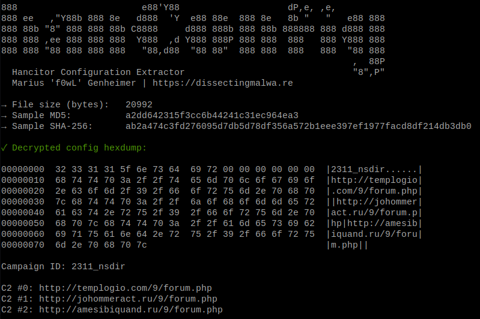
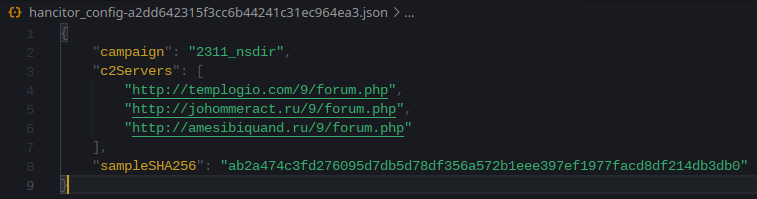

[](https://goreportcard.com/report/github.com/f0wl/hanconfig)

# hanConfig

hanConfig is a static configuration extractor implemented in Golang for the Hancitor Loader (targeting Microsoft Windows, [Malpedia](https://malpedia.caad.fkie.fraunhofer.de/details/win.hancitor)). By default the script will print the extracted information to stdout (verbose output can be enabled with the ```-v``` flag). It is also capable of dumping the malware configuration to disk as a JSON file with the ```-j``` flag.

### Usage 

```shell
go run hanconfig.go [-j | -v] path/to/unpacked_hancitor.dll
```

### Screenshots

The script itself, running in verbose mode and with JSON output enabled:

<p align="center">

</p>

A JSON file with the extracted configuration:

<p align="center">

</p>

## Testing

This configuration extractor has been tested successfully with the following samples:

|                             SHA-256                              |                     Sample                              |
| :--------------------------------------------------------------: | :-----------------------------------------------------: |
| ab2a474c3fd276095d7db5d78df356a572b1eee397ef1977facd8df214db3db0 | [Malshare](https://malshare.com/sample.php?action=detail&hash=ab2a474c3fd276095d7db5d78df356a572b1eee397ef1977facd8df214db3db0) |
| f4f18fd34162fda6ce4bef18228de8c1bdc1c5285abaf2fa73c1ccbe087a34dd | [Malshare](https://malshare.com/sample.php?action=detail&hash=f4f18fd34162fda6ce4bef18228de8c1bdc1c5285abaf2fa73c1ccbe087a34dd) |

If you encounter an error with HanConfig, please file a bug report via an issue. Contributions are always welcome :)
